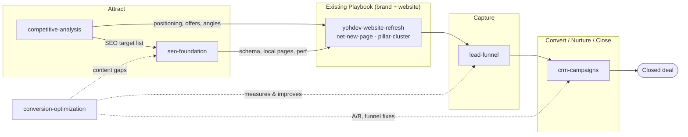

# Marketing Engine

How the Playbook grows from a **website build system** into a **growth engine** — the layer that
lives *downstream* of the site (turn traffic into leads, leads into customers) and *upstream* of it
(be found, be differentiated).

> **Status: planned.** This directory is a planning deliverable, not shipped skills. It documents the
> path — capability specs, sequencing, and success metrics — so the work can be built later. Nothing
> here changes the existing build system. See [ROADMAP.md](ROADMAP.md) for delivery order. The first
> pilot driving this work is **client-specific and lives in that client's fork** under
> `demos/<client>/planning/`, per the [fork model](../../UPSTREAM.md) — it is not carried upstream.

## Why this exists

The build system today (see [../BUILD-SYSTEM.md](../BUILD-SYSTEM.md)) is excellent at one thing:
producing consistent, on-brand, accessible **websites** on any client's design system. It stops at
the website. For a client whose success is measured in **leads and closed deals**, the website is the
*middle* of the story, not the end.

The Marketing Engine documents the missing halves:

- **Upstream of the site** — how the brand gets *found* and how it *differs*: competitive analysis and
  SEO. These feed the Playbook rather than follow it.
- **Downstream of the site** — how traffic becomes revenue: lead capture, CRM & campaign management,
  and conversion optimization.

It is the same philosophy as the rest of the repo — **brand-agnostic, reusable, forkable per client**
— applied to marketing operations instead of markup.

## The organizing model — funnel stage × the optimize loop

The build system is organized by **source × scope**. The Marketing Engine adds a second axis:
**funnel stage**, wrapped in a continuous **measure → optimize** loop. Five new capabilities, each a
standalone skill (specced here, built later), map onto it:

| Funnel stage | Capability (planned skill) | What it does |
|---|---|---|
| **Attract** — be found & differentiated | [`competitive-analysis`](competitive-analysis.md) | Benchmark competitors; extract positioning, offers, pricing signals, and ad angles; find the whitespace. **Feeds** brand positioning. |
| **Attract** — organic & local | [`seo-foundation`](seo-foundation.md) | Technical + local/multi-region SEO **designed into** the site build, not bolted on after. |
| **Capture** — traffic → leads | [`lead-funnel`](lead-funnel.md) | Ad destination → landing pages → forms → tracking → CRM intake. The core new value. |
| **Convert / Nurture / Close** | [`crm-campaigns`](crm-campaigns.md) | Pipelines, **speed-to-lead** routing, nurture campaigns, lifecycle stages so the sales team "fires." |
| **Optimize** — continuous | [`conversion-optimization`](conversion-optimization.md) | Measurement, funnel diagnostics, and experiments that feed back into all of the above. |



## Two placement rules

1. **`competitive-analysis` is a pre-Playbook input.** It runs *before* or alongside brand positioning
   and feeds `yohdev-website-refresh` (Phase 01 Intake / Phase 02 Research). You cannot differentiate
   a brand you haven't benchmarked.
2. **`seo-foundation` is designed *into* the site build.** Schema markup, metadata, URL/IA, local
   service-area pages, and performance are decisions made during the build — retrofitting SEO onto a
   finished site is slower and worse. It hooks the existing page/site builders rather than replacing
   them.

The remaining three (`lead-funnel`, `crm-campaigns`, `conversion-optimization`) are the genuinely new
**post-site** layer.

## The CRM-agnostic + HubSpot-reference principle

Every capability here is written to a **platform-agnostic contract** (what the capability must do,
what data it reads/writes, what a "campaign" or "pipeline stage" means) with **HubSpot as the worked
reference implementation** (concrete objects, properties, and API/MCP calls). This mirrors the repo's
existing philosophy — the way builders "reuse the brand's design system verbatim" but stay
brand-agnostic. A client on GoHighLevel, Salesforce, or a bare Meta-Lead-Ads → spreadsheet setup
implements the same contract against their own stack.

Why HubSpot as the reference: YohDev already has HubSpot tooling wired, it covers CRM + campaigns +
landing pages + analytics in one place, and it is the most reusable choice across YohDev's ~40
existing clients.

## Shared conventions (inherited from the build system)

The Marketing Engine skills inherit the same guarantees the builders already follow:

- **No invented copy / no invented data** — ad angles, offers, and claims come from the brief, the
  legacy source, or verified competitor research; never fabricated.
- **Real assets, hosted locally** — landing-page imagery follows the same rule as page builds.
- **Reuse the design system verbatim** — landing pages and forms use the brand's tokens/components;
  no new colors/fonts/radii.
- **Provenance** — each skill emits `01-…` / `02-…` artifacts recording what it found and what it
  built, exactly like the page builders.
- **ADA / WCAG AA gate** — any capability that produces `output/*.html` (landing pages, forms) must
  pass `npm run ada:scan`, including the red-on-dark contrast check, and clears the pre-commit hook.
- **Branch → PR → preview → merge** — nothing goes live until a named approver merges.
- **One thing per run** — like `pillar-cluster`'s "one cluster per run," each skill has an explicit,
  bounded scope per invocation (one funnel, one campaign, one audit) — no crawl/auto-discovery.

## How it relates to the platform vision

The longer arc for this work is YohDev moving from a services business toward a **platform** — the
Playbook plus agency workflows ("the agency engine") sold to clients and partner agencies. The
Marketing Engine is the second product surface of that platform (the website builder being the first).
Standing it up for a pilot client, refining the modules from that client's feedback, and then packaging
it as a repeatable, resellable workflow is exactly the platform motion — the first engagement doubles
as product R&D.

## Where things live

```
docs/marketing-engine/
├── README.md                     # this file — overview + funnel model
├── ROADMAP.md                    # delivery order, dependencies, milestones, metrics
├── competitive-analysis.md       # skill spec (Attract — differentiate)
├── seo-foundation.md             # skill spec (Attract — organic/local)
├── lead-funnel.md                # skill spec (Capture)
├── crm-campaigns.md              # skill spec (Convert/Nurture/Close)
└── conversion-optimization.md    # skill spec (Optimize)
```

The **client pilot** that drives this work is client-specific and lives in that client's fork under
`demos/<client>/planning/` — it is not carried upstream (see [UPSTREAM.md](../../UPSTREAM.md)).

When these skills are built, they will live under `.claude/skills/<skill>/` with a `phases/`
directory, following the exact pattern of the existing builders. These specs are the blueprints for
that step.
