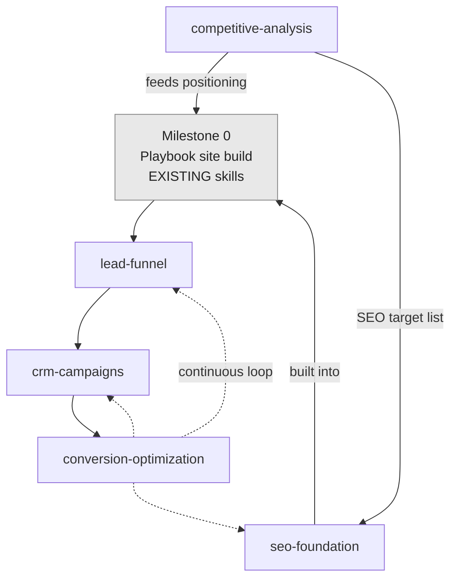

# Marketing Engine — Roadmap

The delivery order for the five planned capabilities (see [README.md](README.md)), the dependencies
between them, the milestones, and the success metrics they're accountable to. Written against the
first pilot (client-specific — the pilot brief lives in that client's fork under
`demos/<client>/planning/`), but the sequence generalizes to any client.

> **Status: planned.** This is a build order for future work, not a record of shipped skills.

## Guiding principles (from discovery)

- **Funnel-first, content-last.** The client's stated priority is leads, not blog posts. Build the
  capture → CRM path before content marketing.
- **Speed-critical.** It's the client's own money; every day without a live funnel is delayed revenue.
  Favor a thin end-to-end funnel over a wide, polished one.
- **Build SEO in, don't retrofit.** Structural SEO decisions belong to the site build.
- **Benchmark before you position.** Competitive analysis precedes brand positioning.
- **One thing per run.** Each skill has a bounded scope per invocation (mirrors `pillar-cluster`).
- **Every engagement is also product R&D.** The pilot refines the modules so they become resellable.

## Build order

The capabilities are **not** built in funnel order — they're built in **dependency + value order**.
Competitive analysis and SEO wrap around the *existing* Playbook site build; the new post-site layer
(capture → CRM) comes next because it's where the unmet value is; CRO is last because it needs live
traffic to act on.

| # | Capability | Depends on | Why here |
|---|---|---|---|
| 1 | `competitive-analysis` | — | Cheap, fast, and feeds everything else (positioning, offers, ad angles, SEO targets). Runs before/with brand positioning. |
| 2 | `seo-foundation` | competitive-analysis (keyword/topic targets) | Must be designed into the site build; blocks nothing but must land *with* the site, not after. |
| 3 | `lead-funnel` | live site + brand (existing Playbook) | The core new value: turns the finished site's traffic into CRM leads. |
| 4 | `crm-campaigns` | lead-funnel (leads must exist to route/nurture) | Makes the sales team "fire" — speed-to-lead routing + nurture so no lead goes cold. |
| 5 | `conversion-optimization` | live funnel + CRM data | Needs real traffic and pipeline data before experiments mean anything. |

## Milestones

Each milestone is a shippable, reviewable increment (branch → PR → preview → merge).

### M0 — Foundation (existing Playbook)
Brand + design system + live site via `yohdev-website-refresh` / `net-new-page` / `pillar-cluster`.
**Not part of this roadmap's new work** — it's the substrate. Competitive analysis (M1) feeds its
positioning; SEO (M2) is built into it.

### M1 — Know the field (`competitive-analysis`)
A competitor benchmark deliverable: positioning map, offer/pricing signals, ad-angle inventory,
messaging whitespace, and SEO target list. **Exit:** positioning inputs handed to the Playbook build;
ad angles handed to M3.

### M2 — Be findable (`seo-foundation`)
Technical SEO baked into the site (schema, metadata, IA/URLs, sitemap, performance) plus a
local/service-area page structure and a keyword→page map. **Exit:** site ships SEO-complete; audit
passes; local pages resolve.

### M3 — Capture leads (`lead-funnel`) — *the priority*
A working thin funnel: ad destination(s) → landing page(s) on-brand + ADA-clean → form → event
tracking → lead lands in CRM with source attribution. **Exit:** a test lead flows end-to-end from ad
click to CRM record with UTM/source intact.

### M4 — Close leads (`crm-campaigns`)
Pipeline stages matching the client's deal model, **speed-to-lead** instant routing + first-touch
SMS/email, and at least one nurture sequence for un-closed leads. **Exit:** a new lead auto-routes to
a rep within the target speed-to-lead window; nurture fires on no-response.

### M5 — Improve continuously (`conversion-optimization`)
A measurement baseline (funnel conversion rates by stage), a diagnostics pass, and a prioritized
experiment backlog with at least one experiment running. **Exit:** funnel dashboard live; first
experiment shipped with a readout plan.

## Success metrics (tie back to the client's goals)

The engine is accountable to funnel outcomes, not output volume:

| Stage | Metric | Source |
|---|---|---|
| Attract | Impressions / clicks; organic + local ranking for target terms | Ad platform · Search Console |
| Capture | **Cost per lead**; landing-page form **conversion rate**; % leads with clean source attribution | Ad platform · analytics · CRM |
| Convert | **Speed-to-lead** (lead-created → first contact); lead → appointment rate | CRM |
| Close | Appointment → **closed-won** rate; **cost per acquisition**; revenue attributed by source/campaign | CRM · attribution reporting |
| Optimize | Experiment velocity; lift per shipped experiment | CRO backlog |

Baseline targets are set per client in the pilot brief, not here (this doc is portable).

## MVP guardrails / what's deferred

To keep the pilot fast and the modules tight, the **first** pass of each skill deliberately excludes:

- **Multi-channel ads** — start with the client's one live channel; Google/LSA later.
- **Multi-touch attribution modeling** — start with first/last-touch source stamping; full path
  attribution later.
- **Marketing automation sprawl** — one nurture sequence and one routing rule first, not a dozen.
- **Content marketing / blog engine** — explicitly last, per the client's own priority.
- **Auto-discovery / crawling** — scope (competitors, funnels, keywords) is always an explicit input,
  never auto-expanded, mirroring `pillar-cluster`'s "spokes are explicit" rule.

These are noted in each spec's **Open questions / deferred** section so nothing silently disappears.

## Relationship to the existing build system

| Existing | Marketing Engine touchpoint |
|---|---|
| `yohdev-website-refresh` (Intake/Research) | consumes `competitive-analysis` output |
| `net-new-page` / `pillar-cluster` | `seo-foundation` hooks these; `lead-funnel` builds landing pages via the same page-build conventions |
| `ada-compliance-scan` + pre-commit hook | gates every landing page / form the engine produces |
| Surge PR preview pipeline | previews landing pages before they go live |
